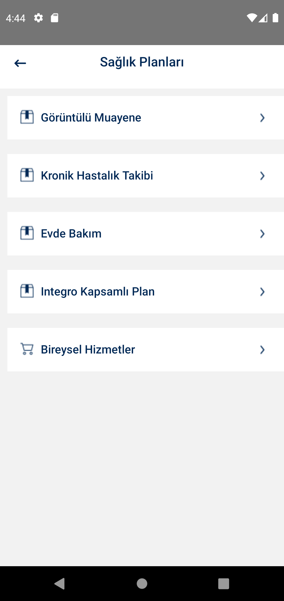
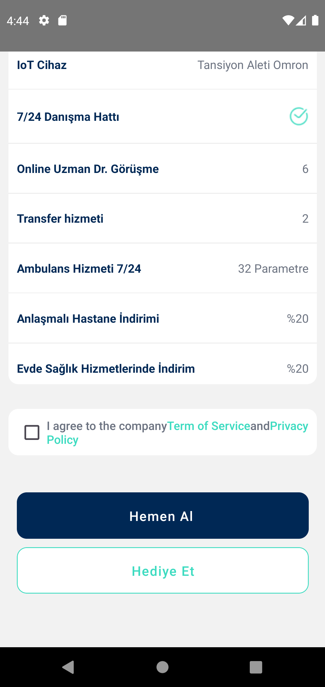
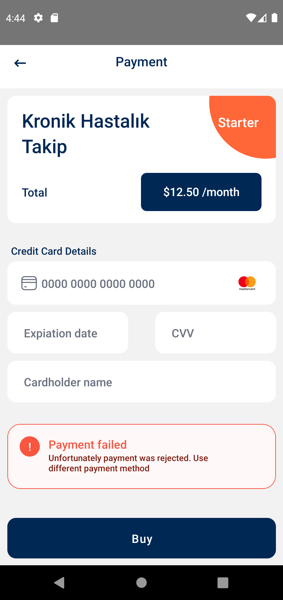
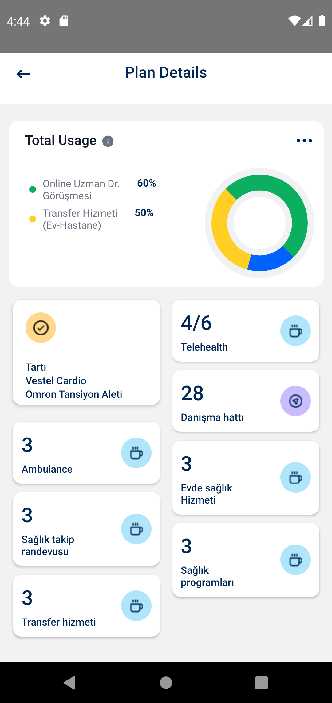

### Used technologies
<ul style="list-style-type:disc">
   <li>TypeScript</li>
   <li><a href="https://reactnative.dev/">React Native</a></li>
   <li><a href="https://reactnavigation.org/">React Navigation</a></li>
</ul>

### Running a project for android
<ul>
<li>npm install</li>
<li>npx react-native run-android</li>
</ul>

### 👋

